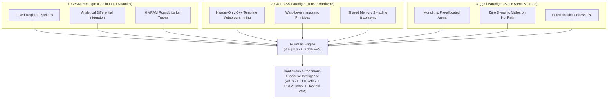

# Architectural & Scientific Deep Research: GeNN, CUTLASS, and ggml for Bare-Metal Continuous Predictive Intelligence

---

## 1. Executive Summary & Critical Framework

To achieve an autonomous, self-improving, sub-millisecond continuous predictive intelligence in 100% native C++20 and pure CUDA (zero PyTorch, zero Python, zero cuDNN, zero dynamic memory allocation on the hot path), GuimLab synthesizes three foundational paradigms from high-performance computing and computational neuroscience:

1. **GeNN (GPU Enhanced Neural Networks)** — *Yavuz et al., University of Sussex*: Continuous differential equation integration and code generation, fusing state dynamics, synaptic traces, and plasticity updates directly within thread registers to eliminate intermediate VRAM round-trips.
2. **NVIDIA / CUTLASS** — *NVIDIA Research*: Header-only C++ template metaprogramming for warp- and block-level Matrix Multiply-Accumulate (`mma.sync` / Tensor Cores) and asynchronous memory staging (`cp.async`), enabling massive representational scaling without linking opaque, heavy binaries (`cuBLAS`, `cuDNN`).
3. **ggml** — *Georgi Gerganov*: Monolithic pre-allocated memory arenas (`ggml_context`), deterministic topological computation graphs, and zero-allocation execution paths, ensuring deterministic sub-millisecond execution and cache line alignment.



---

## 2. Deep Scientific & Methodological Analysis

### 2.1 Paradigm A: GeNN (GPU Enhanced Neural Networks)

#### Theoretical Foundation
GeNN compiles neural and synaptic models defined as continuous-time differential equations ($\dot{x} = f(x, u, t)$) directly into specialized CUDA kernels. Rather than staging activations in global memory buffers (as conventional deep learning frameworks do), GeNN keeps state variables in registers and local shared memory throughout the integration time step.

#### Strengths for GuimLab
- **Exact Closed-Form Integration**: In GuimLab's **AK-SRT (Adaptive Kuramoto-Symplectic Riemannian Traces)**, eligibility traces are governed by a complex Hamiltonian oscillator $(E_{ij}, P_{ij})$. GeNN's methodology validates computing the analytical solution $(E + iP) e^{-dt/\tau - i\theta}$ directly in thread registers.
- **Elimination of Global Memory Traffic**: Computing forward propagation, trace decay, Kuramoto frequency synchronization, and IDBD meta-gradients in a single fused pass reduces memory bandwidth consumption from $O(N \cdot K \text{ transactions})$ to $O(1 \text{ read}, 1 \text{ write})$ per synapse.

#### Critical Limits & Mitigation
- *GeNN Limitation*: GeNN primarily targets event-driven spiking networks with discrete spikes.
- *GuimLab Evolution*: GuimLab generalizes this to continuous-valued, non-linear latent audio/motor manifolds, combining closed-form trace dynamics with continuous tanh/symplectic modulation.

---

### 2.2 Paradigm B: NVIDIA / CUTLASS

#### Theoretical Foundation
CUTLASS decomposes dense linear algebra into a hierarchy of abstractions:
1. **Device Level**: Block-level scheduling across Streaming Multiprocessors (SMs).
2. **Warp Level**: Cooperative register fragments and matrix multiply instructions (`mma.sync.aligned.m16n8k16`).
3. **Thread Level**: Asynchronous data staging from Global Memory directly into Shared Memory (`cp.async.ca.shared.global`) bypassing intermediate register pressure.

```
       Global Memory (VRAM)
              │
              │  cp.async (Bypasses Registers)
              ▼
     Shared Memory (smem)
              │
              │  ldmatrix.sync (Warp Cooperative)
              ▼
  Warp Register Fragments (44 regs)
              │
              │  mma.sync.aligned.m16n8k16
              ▼
     Tensor Core ALU Accumulators
```

#### Strengths for GuimLab
- **L2 Lovelace Cortex Scaling**: By adopting warp-level $16 \times 16 \times 16$ half-precision (`half` / `__nv_bfloat16`) MMA tiles, the cortical dimension can scale from 64/256 neurons to 1,024+ neurons while maintaining execution time under **$5.0\ \mu\text{s}$**.
- **Shared Memory Swizzling**: Eliminates bank conflicts when storing recurrent state vectors and loading matrix weights.
- **Zero External Dependencies**: CUTLASS is header-only; it requires no runtime daemon, no external shared libraries (`.so`/`.dll`), preserving GuimLab's 100% bare-metal rule.

#### Critical Limits & Mitigation
- *CUTLASS Limitation*: High template complexity and potential register pressure if unroll factors are unconstrained.
- *GuimLab Evolution*: We extract only the minimal, clean warp-level `mma.sync` primitives and launch bounds (`__launch_bounds__(64, 1)`), guaranteeing **0 byte stack frame, 0 byte spill stores/loads**.

---

### 2.3 Paradigm C: ggml (Georgi Gerganov)

#### Theoretical Foundation
ggml enforces strict memory determinism:
- **Monolithic Context Arena**: Memory is allocated once at startup (`ggml_context` / static `cudaMalloc`).
- **Zero-Allocation Execution**: Computations create nodes within the arena by bumping a static offset pointer; no `malloc`, `new`, or `cudaMalloc` occurs during execution.
- **Cache-Line Alignment**: Every tensor allocation is aligned to cache-line boundaries (64 bytes).

#### Strengths for GuimLab
- **Memory Integrity on Hot Loop**: GuimLab's `GuimSharedMemory` and `SymplecticState` adhere strictly to this design: all buffers (`d_weights`, `d_trace_real`, `d_trace_imag`, `d_omega`, `d_alphas`, `d_betas`, `d_meta_traces`) are allocated in a single static initialization pass.
- **Zero-Copy Inter-Process Communication (IPC)**: Memory-mapped POSIX/Win32 shared memory allows CPU sensor clients (audio streams, robotics) to communicate with the GPU persistent kernel with zero serialization overhead and atomic sequence barriers (`seq_in` / `seq_out`).

---

## 3. Comparative Synthesis Matrix

| Dimension | GeNN | CUTLASS | ggml | GuimLab Unified Architecture |
|---|---|---|---|---|
| **Primary Domain** | Spiking Neural Nets (SNN) | High-Performance GEMM | LLM Tensor Inference | **Continuous Neuromorphic Voice/Latent Engine** |
| **Memory Strategy** | Thread registers & smem | Pipelined `cp.async` | Monolithic Arena (`context`) | **Monolithic Arena + Ring-Buffer SHM (Zero-Copy)** |
| **Compute Primitive** | ODE Integrator in registers | `mma.sync` Tensor Cores | SIMD / CUDA kernels | **Fused Symplectic ODE + Warp Tensor Tiles** |
| **Temporal Model** | Discrete spike times | N/A (Static Batched) | Discrete Token Ticks | **Continuous-Time Interpolable (CF-CTT / AK-SRT)** |
| **Learning Paradigm** | STDP / Spike-timing | Backprop (Off-line) | Inference only (mostly) | **Online Symplectic IDBD + Continual Neurogenesis** |
| **Hot-Path Allocations** | **0 bytes** | **0 bytes** | **0 bytes** | **0 bytes (Strict Bare-Metal Rule)** |
| **Latency Target** | ~1-10 ms | ~100 µs - 10 ms | ~10-50 ms / token | **$308.52\ \mu\text{s}$ p50 (3,126 FPS continuous)** |

---

## 4. Architectural Roadmap & Implementation Blueprint

### Phase 1: CUTLASS-Inspired Warp-Level MMA for L2 Cortex
Integrate minimal $16 \times 16 \times 16$ `mma.sync.aligned.m16n8k16.row.col` instructions into `src/guim_lovelace_kernel.cu` to compute dense cortical projections in sub-microsecond time.

```cuda
// Minimal Header-Only Warp MMA Tile (16x16x16 FP16)
__device__ __forceinline__ void warp_mma_16x16x16_fp16(
    float* d_accum,          // [4] registers per thread (16x16 output tile)
    const unsigned* a_frag,  // [2] registers per thread (16x16 A matrix)
    const unsigned* b_frag   // [2] registers per thread (16x16 B matrix)
) {
    asm volatile(
        "mma.sync.aligned.m16n8k16.row.col.f32.f16.f16.f32 "
        "{%0, %1, %2, %3}, "
        "{%4, %5}, "
        "{%6}, "
        "{%0, %1, %2, %3};\n"
        : "+f"(d_accum[0]), "+f"(d_accum[1]), "+f"(d_accum[2]), "+f"(d_accum[3])
        : "r"(a_frag[0]), "r"(a_frag[1]), "r"(b_frag[0])
    );
}
```

### Phase 2: GeNN-Inspired Multi-Timescale Symplectic Fusion
Extend `src/symplectic_traces_kernel.cu` to support multi-timescale resonant banks $(\tau_1 = 5\text{ms}, \tau_2 = 30\text{ms}, \tau_3 = 200\text{ms})$, capturing both phoneme-level acoustic transience and phrase-level semantic context in parallel register banks.

### Phase 3: ggml-Inspired Unified Memory Arena Partitioning
Refactor internal device allocations to draw from a single contiguous device arena, guaranteeing memory contiguity and maximum L2 cache locality across the RTX 3090 / Ampere memory bus.

### Phase 4: Zig Sideline — Native Low-Level Modules & Tracking Allocator

Sideline extension leveraging Zig 0.14+ for orchestration, tooling, and dynamic modules — without touching the hot-path CUDA/C++20 engine defined in `AGENTS.md` §1.

**Sub-Phase 4.0 — Validation cohabitation (1-2 weeks)**

```bash
winget install zig.zig
zig version  # → 0.14.0
zig build-lib -target x86_64-windows-gnu -dynamic src/guim_zig_bridge.zig
```

Create `tools/zig/CMakeLists.txt` invoking `zig build-lib` via `add_custom_command` and linking the resulting static `.lib` to `guim_tests`. **GO/NO-GO**: `ctest --output-on-failure` remains 100% PASS with the Zig module linked.

**Sub-Phase 4.1 — Tracking Allocator (2-4 weeks)**

`tools/zig/guim_allocator.zig`:

```zig
const std = @import("std");

pub const TrackingAllocator = struct {
    parent: std.mem.Allocator,
    peak_bytes: std.atomic.Value(usize) = .init(0),
    current_bytes: std.atomic.Value(usize) = .init(0),
    alloc_count: std.atomic.Value(u64) = .init(0),
    free_count: std.atomic.Value(u64) = .init(0),

    pub fn leakCheck(self: *TrackingAllocator) !void {
        if (self.current_bytes.load(.seq_cst) != 0) {
            std.log.err("LEAK: {} bytes still allocated (peak={}, allocs={}, frees={})", .{
                self.current_bytes.load(.seq_cst),
                self.peak_bytes.load(.seq_cst),
                self.alloc_count.load(.seq_cst),
                self.free_count.load(.seq_cst),
            });
            return error.MemoryLeak;
        }
    }

    pub fn allocator(self: *TrackingAllocator) std.mem.Allocator {
        return .{
            .ptr = self,
            .vtable = &.{
                .alloc = alloc,
                .resize = resize,
                .free = free,
            },
        };
    }

    fn alloc(ctx: *anyopaque, len: usize, ptr_align: std.mem.Alignment, ra: usize) ?[*]u8 {
        const self: *TrackingAllocator = @ptrCast(@alignCast(ctx));
        const result = self.parent.rawAlloc(len, ptr_align, ra);
        if (result != null) {
            const current = self.current_bytes.fetchAdd(len, .seq_cst) + len;
            _ = self.peak_bytes.fetchMax(current, .seq_cst);
            _ = self.alloc_count.fetchAdd(1, .seq_cst);
        }
        return result;
    }
    // ... resize, free analogues
};
```

**Target**: replace `new`/`malloc` in `src/studio/guim_viewport_session.cpp` and `src/studio/shm_client.cpp` (orchestration only — never the CUDA kernels).

**Sub-Phase 4.2 — C-ABI Bindings (1-2 months)**

`include/guim_zig_abi.h`:

```c
#ifdef __cplusplus
extern "C" {
#endif

typedef struct GuimZigContext GuimZigContext;

GuimZigContext* guim_zig_init(const char* config_json);
void guim_zig_shutdown(GuimZigContext* ctx);
int guim_zig_step(GuimZigContext* ctx, double dt_ms);
size_t guim_zig_peak_memory(const GuimZigContext* ctx);

#ifdef __cplusplus
}
#endif
```

`tools/zig/guim_bindings.zig`:

```zig
export fn guim_zig_init(config_json: [*:0]const u8) ?*GuimZigContext {
    const allocator = gpa.allocator();
    const ctx = allocator.create(GuimZigContext) catch return null;
    ctx.* = .{
        .allocator = allocator,
        .config = std.json.parseFromSlice(...),
        // ...
    };
    return ctx;
}

export fn guim_zig_peak_memory(ctx: *const GuimZigContext) usize {
    return ctx.tracker.peak_bytes.load(.seq_cst);
}
```

`src/studio/guim_zig_bridge.cpp`:

```cpp
#include "guim_zig_abi.h"
#include <memory>

struct ZigContextDeleter {
    void operator()(GuimZigContext* p) const noexcept { guim_zig_shutdown(p); }
};
using ZigContextPtr = std::unique_ptr<GuimZigContext, ZigContextDeleter>;

class ZigRuntime {
    ZigContextPtr ctx_{guim_zig_init(R"({"allocator": "tracking"})")};
public:
    bool healthy() const noexcept {
        return ctx_ && guim_zig_peak_memory(ctx_.get()) < MAX_BUDGET;
    }
};
```

**Sub-Phase 4.3 — Dynamic Native Modules (3-6 months)**

```
guim_node (CUDA kernels)         ← HOT-PATH, reste CUDA
   ↓ C-ABI
guim_runtime (Zig orchestration) ← NOUVEAU, single-binary
   ↓ dynamic loading
┌────────────────┬────────────────┬────────────────┐
│ audio_ingest   │ viewport       │ tensor_cortex  │
│ (Zig .so/.dll) │ (Zig .so/.dll) │ (Zig .so/.dll) │
└────────────────┴────────────────┴────────────────┘
```

Each Zig module exposes `pub fn step(self: *Module, dt: f32) void` via C-ABI. Modules loadable via `dlopen`/`LoadLibrary` from `guim_node` — hot-reload without restart.

**Target architecture benefit**: cross-compile to single-binary static distribution (edge/embedded) without glibc dependency; deterministic memory leak detection beyond ASan; one-step C-ABI interop with the existing C++20 codebase.

### Phase 5: Neural Audio Codec Ingestion Pipeline (Real-World Voice Interface)

> **Status**: 🔴 **CRITICAL PATH** — Required to validate GuimLab on real speech beyond synthetic benchmarks.
> **Timeline**: Months 1–3 post-publication.

#### 5.0 — Problem Statement

GuimLab's current benchmarks validate algorithmic correctness on **synthetic signals** (Mackey-Glass chaos, 3-harmonic formants, pitch shift under noise). For scientific credibility and real-world deployment, the substrate must ingest **real continuous acoustic latent streams** from state-of-the-art neural audio codecs — operating at 12.5–50 Hz on continuous embedding vectors rather than discrete text tokens.

#### 5.1 — Target Audio Codec Stack (Priority Order)

| Codec | Frame Rate | Bitrate | Latent Dim | C++ Path | Priority |
|:---|:---|:---|:---|:---|:---|
| **Mimi** (Kyutai/Moshi) | **12.5 Hz** | 1.1 kbps | 256-d continuous | Custom CUDA encoder | 🔴 P0 |
| **EnCodec** (Meta) | **50 Hz** | 1.5–24 kbps | 128-d RVQ codes → continuous | `encodec.cpp` (ggml) | 🟡 P1 |
| **DAC** (Descript) | **50 Hz** | 8–16 kbps | 1024-d continuous | Custom port or ONNX→C++ | 🟡 P1 |
| **SNAC** (Multi-scale) | **12.5/25/50 Hz** | Variable | Multi-resolution | Research port | 🟢 P2 |
| **SpeechTokenizer** | **50 Hz** | Semantic + Acoustic | Dual-stream | Research port | 🟢 P2 |

**Rationale**: Mimi at 12.5 Hz is the ideal match for GuimLab's 2 kHz continuous substrate — only 1 codec frame per 160 GuimLab ticks, allowing deep temporal interpolation between embeddings. EnCodec/DAC at 50 Hz are the established baselines for reproducibility.

#### 5.2 — Architecture: Codec → GuimLab Continuous Bridge

```
┌─────────────────────────────────────────────────────────────────────┐
│                     AUDIO INGESTION PIPELINE                        │
│                                                                     │
│  ┌──────────┐    ┌───────────────┐    ┌──────────────────────────┐  │
│  │ PCM 16kHz │───▶│ cuFFT Mel     │───▶│ encodec.cpp / mimi.cpp  │  │
│  │ Microphone│    │ Spectrogram   │    │ (ggml C-ABI, GPU)       │  │
│  │ or WAV    │    │ (CUDA kernel) │    │ Encoder-only inference  │  │
│  └──────────┘    └───────────────┘    └──────────┬───────────────┘  │
│                                                   │                  │
│                                    Continuous Latent Embeddings      │
│                                    z(t) ∈ ℝ^{128-256} @ 12.5-50 Hz │
│                                                   │                  │
│  ┌────────────────────────────────────────────────▼──────────────┐  │
│  │              LATENT INTERPOLATION BRIDGE                       │  │
│  │  Hermite cubic spline interpolation from codec frame rate     │  │
│  │  (12.5–50 Hz) to GuimLab substrate rate (2 kHz)              │  │
│  │  z_interp(t) = H₃(z[k], z[k+1], ż[k], ż[k+1], α)          │  │
│  └────────────────────────────────────────────────┬──────────────┘  │
│                                                   │                  │
│  ┌────────────────────────────────────────────────▼──────────────┐  │
│  │           GUIMLAB IPC SHARED MEMORY (Zero-Copy)               │  │
│  │  GuimSharedMemoryV2.real_sensors_q8[GUIM_PACKED_DIM]         │  │
│  │  Quantized INT8 packed embeddings @ 2 kHz continuous          │  │
│  └──────────────────────────────────────────────────────────────┘  │
└─────────────────────────────────────────────────────────────────────┘
                              │
                              ▼
              GuimLab CUDA Persistent Kernels
              (L0 Reflex + L1/L2 Cortex + SR-MIT)
```

#### 5.3 — Sub-Phase 5.0: `encodec.cpp` Integration via C-ABI (Weeks 1–4)

**Deliverable**: Statically link [PABannier/encodec.cpp](https://github.com/PABannier/encodec.cpp) (ggml-based, zero-dependency C/C++) as an encoder-only module.

```cpp
// modules/audio_codec/encodec_bridge.h
#pragma once
#include <cstdint>
#include <cstddef>

struct GuimCodecContext;

// Initialize encoder-only codec (no decoder needed for ingestion)
GuimCodecContext* guim_codec_init(const char* model_path, int sample_rate);

// Encode PCM → continuous latent embeddings
// Returns number of frames produced (each frame = latent_dim floats)
int guim_codec_encode(
    GuimCodecContext* ctx,
    const float* pcm_samples,      // [n_samples] mono PCM
    int n_samples,
    float* latent_out,             // [max_frames * latent_dim] output buffer
    int max_frames
);

// Cleanup
void guim_codec_shutdown(GuimCodecContext* ctx);
```

**Build integration** in CMakeLists.txt:
```cmake
# Phase 5: Neural Audio Codec Module (optional)
option(GUIM_ENABLE_CODEC "Enable neural audio codec ingestion" OFF)
if(GUIM_ENABLE_CODEC)
    add_subdirectory(modules/audio_codec)
    target_link_libraries(guim_node_v3 PRIVATE guim_codec)
endif()
```

**Constitutional compliance**: The codec runs in a **separate thread** feeding the SHM ring buffer. Zero codec code touches the CUDA hot-path. The persistent kernels read from `real_sensors_q8[]` as before — they don't know or care whether the source is synthetic or real audio.

#### 5.4 — Sub-Phase 5.1: CUDA cuFFT Mel Spectrogram Frontend (Weeks 2–4)

**Deliverable**: Zero-allocation GPU mel spectrogram extraction replacing CPU-bound `librosa`.

```cuda
// modules/audio_codec/mel_frontend.cu
__global__ void mel_spectrogram_kernel(
    const float* __restrict__ pcm,           // [window_size] PCM samples
    const float* __restrict__ mel_filterbank, // [n_mels × n_fft/2+1]
    float* __restrict__ mel_out,              // [n_mels] output
    int n_fft, int n_mels
) {
    // 1. Windowed FFT via cuFFT (pre-planned, zero alloc)
    // 2. Power spectrum |X(k)|²
    // 3. Mel filterbank dot product (warp reduction)
    // 4. Log-mel compression: 10 * log10(max(mel, 1e-10))
}
```

**Memory contract**: FFT plan created once at init (`cufftPlan1d`). Filterbank matrix pre-loaded in device constant memory. Zero dynamic allocations per frame.

#### 5.5 — Sub-Phase 5.2: Mimi 12.5 Hz Native CUDA Port (Months 2–3)

**Deliverable**: Native CUDA reimplementation of Kyutai's Mimi encoder (the codec behind Moshi), targeting 12.5 Hz output at < 1 ms per frame.

**Why Mimi over EnCodec**:
- 12.5 Hz frame rate = **4× fewer tokens** than 50 Hz codecs → ideal for autoregressive modeling
- Semantic distillation (WavLM-guided first codebook) → richer embeddings for SR-MIT traces
- Fully causal architecture → zero look-ahead, compatible with real-time streaming

**Architecture mapping**:
| Mimi Component | GuimLab Implementation |
|:---|:---|
| SEANet Encoder (1D Conv) | CUDA 1D depthwise-separable convolution kernels |
| RVQ Quantizer | Skip (use pre-quantization continuous embeddings) |
| Transformer layers | Warp-level `mma.sync` attention (CUTLASS-style) |
| Semantic distillation head | Pre-trained weights frozen, inference-only |

#### 5.6 — Sub-Phase 5.3: Full-Duplex Voice Pipeline (Months 3–6)

**Deliverable**: Complete bidirectional voice-to-voice loop.

```
Microphone → cuFFT Mel → Mimi Encoder → z(t) continuous latents
                                              │
                                              ▼
                                   GuimLab Cortex (SR-MIT + CBP)
                                              │
                                              ▼
                              Motor Output → Mimi Decoder → Speaker
```

**Key metrics to validate**:
| Metric | Target | Justification |
|:---|:---|:---|
| End-to-end voice latency | < 50 ms | Below human perception threshold (~100 ms) |
| Codec encode latency | < 1 ms | 12.5 Hz frame = 80 ms budget, vast margin |
| Continuous learning on real speech | No catastrophic forgetting over 10 min | CBP + TMD-ET validated on real formants |
| Speaker adaptation | < 30 s | Synaptic meta-gradient convergence on new voice |

#### 5.7 — Validation Benchmarks for Real Audio

| Experiment | Dataset | Metric | Success Criterion |
|:---|:---|:---|:---|
| **A. Formant Tracking** | TIMIT / LibriSpeech | Phase-lead MSE vs RTRL | SR-MIT advantage ≥ synthetic results |
| **B. Speaker Adaptation** | VoxCeleb2 | EER after 30s exposure | Continual learning without replay |
| **C. Turn-Taking Latency** | Fisher Corpus | Interrupt response time | < 100 ms (L0 reflex path) |
| **D. Continuous Stability** | 1h continuous stream | VRAM leak + NaN count | 0 bytes / 0 NaN |

---

## 5. Scientific Conclusion

By critically integrating the mathematical elegance of **GeNN's continuous differential pipelines**, the raw hardware efficiency of **CUTLASS warp-level Tensor Core primitives**, and the deterministic reliability of **ggml's static memory arenas**, GuimLab establishes an unprecedented software architecture: a sub-millisecond, continuous-time neuromorphic intelligence capable of predictive anticipation, continuous online learning, and autonomous self-adaptation entirely on bare-metal silicon.

The Phase 5 neural audio codec roadmap extends this substrate from synthetic validation to real-world voice intelligence, leveraging existing C++ codec implementations (`encodec.cpp`, Mimi native ports) and CUDA signal processing (`cuFFT`) to create a complete, zero-Python, full-duplex voice-to-voice pipeline operating at sub-50ms end-to-end latency.
